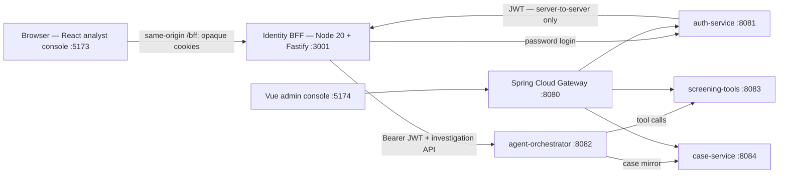
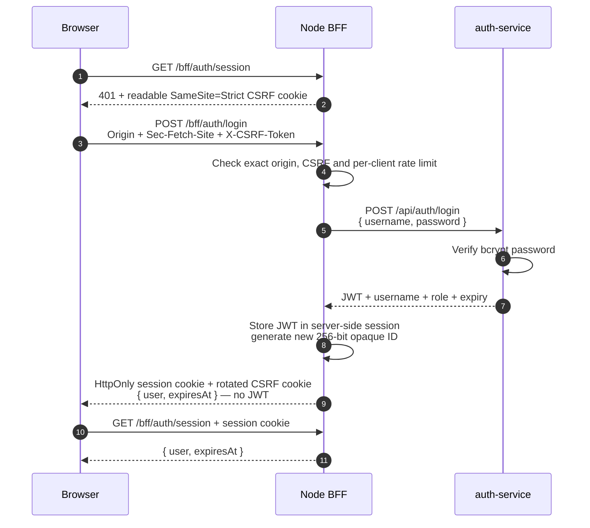
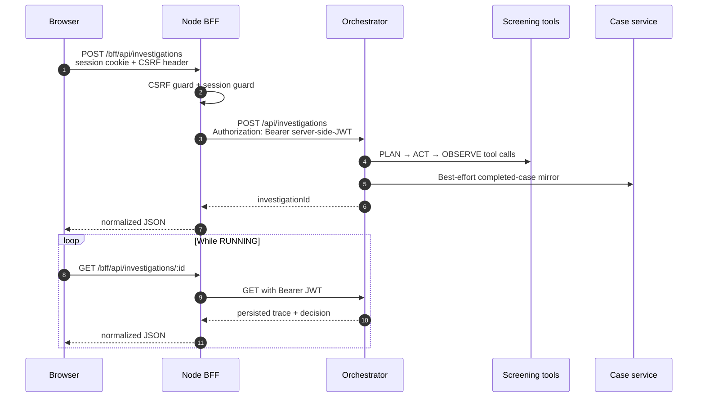
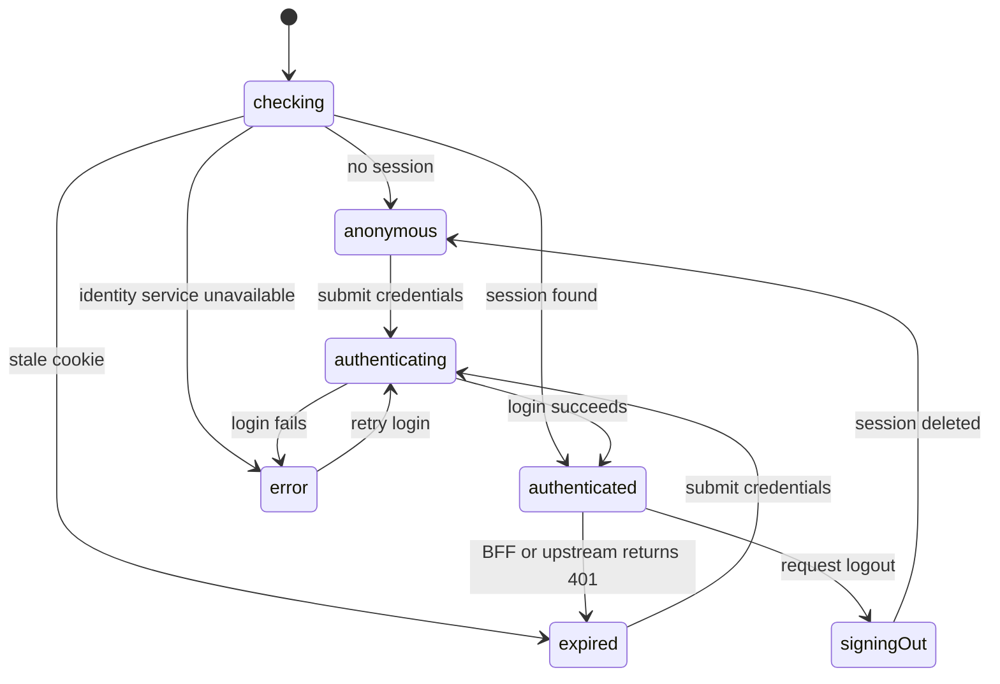

# Architecture

Argus separates browser identity from service credentials. The React console talks only to a
same-origin Node BFF; the BFF owns the Java-service JWT and exposes an opaque browser session.

## Runtime topology

In development Vite proxies `/bff` to port 3001. In deployment the ingress/CDN must preserve
that same-origin shape and terminate HTTPS. The browser never calls `auth-service` or the
orchestrator directly.

## Components

| Component | Port | Stack | Responsibility |
|---|---:|---|---|
| `frontend/analyst-console` | 5173 | React 18, TypeScript, Vite | Login UX, explicit auth state model, route guard, investigation timeline |
| `bff` | 3001 | Node 20, Fastify | Server-side sessions, CSRF/origin checks, login throttling, error normalization, guarded API proxy |
| `api-gateway` | 8080 | Spring Cloud Gateway | Routing/CORS for the existing service and admin-console paths |
| `auth-service` | 8081 | Spring Boot, Security, JPA | bcrypt user store, JWT issue/parse, RBAC |
| `agent-orchestrator-service` | 8082 | Spring Boot, WebFlux, optional Mongo | Agent loop and investigation trace store |
| `screening-tools-service` | 8083 | Spring Boot, JPA | Sanctions/profile/graph/risk tools and catalog |
| `case-service` | 8084 | Spring Boot, JPA | Cases, audit log, screening policy |

The Java backend remains one Maven reactor on Java 17, Spring Boot 3.2 and Spring Cloud
2023.0.x. Every business service validates the JWT and applies its own role authorization.

## Authentication and session flow

Cookie properties:

- `argus_session`: opaque random ID, `HttpOnly`, `SameSite=Strict`, `Path=/bff`; `Secure` is
  mandatory in production. Its value has no user data or JWT.
- `argus_csrf`: random double-submit value, intentionally readable by JavaScript,
  `SameSite=Strict`, `Path=/`. It is sent in `X-CSRF-Token` on every mutation and rotated
  after login/logout.
- The BFF session lifetime never exceeds either the upstream JWT lifetime or the configured
  BFF maximum.

Production startup fails if `BFF_COOKIE_SECURE=false` or `BFF_MOCK_UPSTREAM=true`.

## Protected investigation flow

If an upstream protected route returns 401, the BFF immediately deletes the server-side
session, clears the cookie and returns `SESSION_EXPIRED`. Timeouts and upstream failures are
mapped to stable public error codes without returning Java-service response bodies.

## Frontend authentication state model

`frontend/analyst-console/src/auth/authMachine.ts` uses a discriminated union and reducer:

This avoids contradictory flags such as `isLoggedIn && isExpired`. Only `authenticated` and
`signingOut` carry a session, and the investigation component is mounted only for those two
states. A 401 from any investigation call emits the single session-expired transition.

## Security controls

| Threat/control | Implemented behavior |
|---|---|
| Browser token theft | JWT is stored only in the BFF session; no `VITE_API_TOKEN`, Web Storage or JS-readable auth cookie |
| CSRF | Exact Origin allowlist, optional `Sec-Fetch-Site` enforcement when present, and constant-time double-submit token comparison |
| Session fixation | Previous session is deleted and a fresh opaque session ID + CSRF token are issued after login |
| Credential stuffing | `/bff/auth/login` has per-client rate limiting; auth errors do not reveal whether a username exists |
| Stale/revoked token | Local expiry enforcement plus immediate session deletion on upstream 401 |
| Slow/broken dependency | Abort timeout, `UPSTREAM_TIMEOUT`/`UPSTREAM_UNAVAILABLE` normalization and request IDs |
| Browser caching | Every `/bff/*` response gets `Cache-Control: no-store` and `Pragma: no-cache` |
| Common response-header attacks | Helmet headers are enabled on the JSON BFF; the SPA hosting layer owns the HTML CSP/HSTS policy |
| Unauthorized routes | Fastify pre-handler guards every investigation endpoint; Java services independently validate JWT + roles |
| Unsafe test mode | Mock upstream is explicit and refused when `NODE_ENV=production` |

React's normal text rendering provides output escaping for investigation data. No code uses
`dangerouslySetInnerHTML`. XSS is not "solved" by cookies: a same-origin script could still
act as the user, which is why production must apply a restrictive CSP to the SPA HTML at the
CDN/ingress and keep dependencies patched.

## Data stores

- **SQL (Postgres or zero-infra H2):** users, sanctions fixtures, transaction edges, tool
  status, cases, audit entries and policy.
- **NoSQL (Mongo or in-memory default):** variable-length investigation documents and their
  step/tool observations.
- **BFF session store (current demo):** in-process `Map`; the JWT is not persisted.
- **Redis:** provisioned by Compose but not wired to application code yet.

## Deliberate demo boundaries

These are limitations, not hidden features:

1. The BFF session and rate-limit stores are in-memory and single-instance. A restart signs
   users out; multiple replicas would not share sessions. Production needs Redis or another
   shared, encrypted/controlled store, eviction metrics and an explicit outage policy.
2. Password login is real, but refresh-token rotation, OAuth/OIDC IdP integration, MFA,
   account recovery, WebAuthn and Passkeys are not implemented. Interview design notes must
   not be presented as shipped code.
3. HTTPS/TLS termination and the SPA document CSP belong to deployment infrastructure, which
   is outside this repository. The BFF itself fails closed on insecure production cookies.
4. The login limiter is process-local. A distributed edge and shared-store limiter is needed
   before horizontally scaling.
5. On-chain data is seeded/synthetic; it is not a live chain indexer or production sanctions
   provider.
6. Service-to-service calls inside the Java workflow propagate the originating user's token;
   dedicated workload identity would be cleaner in production.

## Test evidence

- `bff/test`: cookie attributes, no-token response, CSRF/origin, route guard, logout, session
  expiry, upstream 401 invalidation, timeout normalization, rate limiting and production
  configuration safeguards.
- `frontend/analyst-console/src`: reducer plus React Testing Library login failure/success,
  guard and logout behavior.
- `frontend/analyst-console/e2e`: real Chromium anonymous/login/logout journeys using the BFF
  test upstream; asserts the browser session cookie is `HttpOnly` and no JWT/Bearer value is
  placed in Web Storage.
