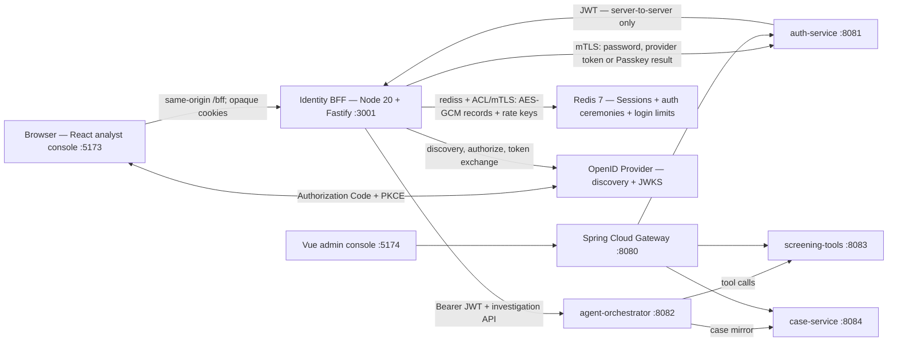
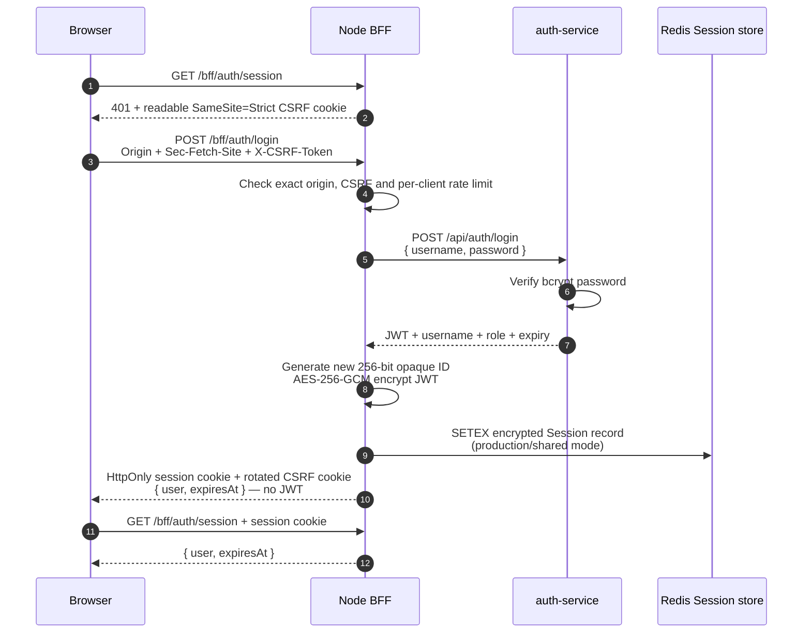
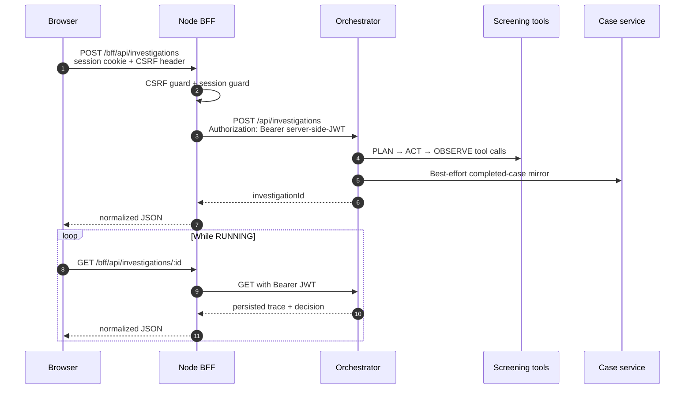
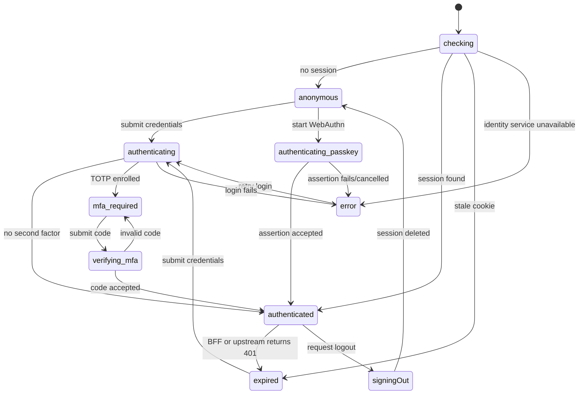

# Architecture

Argus separates browser identity from service credentials. The React console talks only to a
same-origin Node BFF; the BFF owns the Java-service JWT and exposes an opaque browser session.

## Runtime topology



In development Vite proxies `/bff` to port 3001. In deployment the ingress/CDN must preserve
that same-origin shape and terminate HTTPS. The browser never calls `auth-service` or the
orchestrator directly.

## Components

| Component | Port | Stack | Responsibility |
|---|---:|---|---|
| `frontend/analyst-console` | 5173 | React 18, TypeScript, Vite | Password/MFA/recovery/Passkey UX, explicit auth state model, route guard, investigation timeline |
| `bff` | 3001 | Node 20, Fastify | Server-side sessions, OIDC/WebAuthn ceremonies, CSRF/origin checks, login throttling, error normalization, guarded API proxy |
| `redis` | 6379 | Redis 7 | Optional development / required production shared BFF Sessions, one-time auth ceremonies and distributed login limiter |
| `api-gateway` | 8080 | Spring Cloud Gateway | Routing/CORS for the existing service and admin-console paths |
| `auth-service` | 8081 | Spring Boot, Security, JPA | Password/OIDC/Passkey identity, encrypted TOTP MFA, recovery, JWT issue/parse, RBAC |
| `agent-orchestrator-service` | 8082 | Spring Boot, WebFlux, optional Mongo | Agent loop and investigation trace store |
| `screening-tools-service` | 8083 | Spring Boot, JPA | Sanctions/profile/graph/risk tools and catalog |
| `case-service` | 8084 | Spring Boot, JPA | Cases, audit log, screening policy |

The Java backend remains one Maven reactor on Java 17, Spring Boot 3.2 and Spring Cloud
2023.0.x. Every business service validates the JWT and applies its own role authorization.

## Authentication and session flow



Cookie properties:

- `argus_session`: opaque random ID, `HttpOnly`, `SameSite=Strict`, `Path=/bff`; `Secure` is
  mandatory in production. Its value has no user data or JWT.
- `argus_csrf`: random double-submit value, intentionally readable by JavaScript,
  `SameSite=Strict`, `Path=/`. It is sent in `X-CSRF-Token` on every mutation and rotated
  after login/logout.
- The BFF session lifetime never exceeds either the upstream JWT lifetime or the configured
  BFF maximum.
- `argus_mfa_tx`: opaque pre-authentication ID, `HttpOnly`, `SameSite=Strict`, `Path=/bff/auth`.
  The Java challenge token is encrypted in the server store and never exposed to JavaScript.
- `argus_webauthn_tx`: opaque one-time ceremony ID, `HttpOnly`, `SameSite=Strict`,
  `Path=/bff/auth/passkeys`. Its challenge and registration owner are AES-256-GCM encrypted,
  expiry bounded and atomically consumed.

Development defaults to an in-memory store. Production startup fails if
`BFF_COOKIE_SECURE=false`, `BFF_MOCK_UPSTREAM=true`, the Session store is not Redis, or the
Redis URL/encryption key is missing. It additionally requires auth-service HTTPS with a CA-
validated BFF client certificate and `rediss://` with Redis authentication. Redis connection
failure also fails startup.

### Authenticated service transport

The browser-facing TLS connection still terminates at the ingress, but the identity hop has a
separate trust boundary. In production, the BFF loads a private CA, client certificate and
permission-restricted private key, requires TLS 1.2+, validates the auth-service hostname and
presents its client identity. The Spring auth service uses a PKCS12 server key store and CA trust
store with `client-auth=need`; its production guard rejects plain HTTP or optional client auth.

Production Redis uses `rediss://`, certificate validation and ACL credentials. A Redis client
certificate/key pair is also supported for environments that require mTLS. The opt-in
`redis-secure` Compose profile and `infra/tls/generate-dev-pki.sh` provide 14-day local
certificates so positive and missing-client-certificate behavior can be exercised.

### Online encryption-key rotation

Redis identity records use a versioned AES-256-GCM envelope containing a non-secret key ID.
Every new Session, MFA challenge, OIDC transaction and WebAuthn ceremony is written with the
configured primary key. During a rolling rotation, all instances retain both keys; a live
Session read under the old key is atomically rewritten under the primary while preserving its
remaining TTL. One-time pre-authentication records are decrypted with a retained key and then
consumed, so they never need a rewrite. Legacy Session envelopes without a key ID remain readable
only while the explicitly retained legacy key is present.

Java TOTP seeds already use a key-ID envelope. Successful MFA use lazily promotes an old seed,
and `POST /api/auth/admin/identity-keys/rotate?limit=100` drains bounded batches for dormant
accounts and pending enrollments. The operation is JWT-authenticated and ADMIN-only. Old keys are
removed only after the drain reports zero, the longest BFF record TTL has elapsed, and every
region reports the new primary. The executable order and rollback rules live in
[`runbooks/identity-key-rotation.md`](runbooks/identity-key-rotation.md).

### OIDC Authorization Code + PKCE

The optional OIDC path uses provider discovery, a fresh state, nonce and S256 PKCE verifier
per attempt. Only an opaque callback-scoped cookie reaches the browser; the server-side
transaction is encrypted in Redis in production and consumed atomically with `GETDEL`. The
BFF validates the callback and token response, then auth-service independently validates the
ID token's JWKS signature, issuer, audience, expiry and nonce. Accounts are keyed by
`(issuer, subject)` and are never silently linked by email.

### Passkey / WebAuthn

Passkeys use discoverable credentials for usernameless login and require authenticator user
verification. Registration first requires an existing Argus session. The Node BFF uses
SimpleWebAuthn to generate and verify the challenge, exact public origin, RP ID, attestation
and assertion signature. Java stores the credential ID, COSE public key, device/backup flags
and signature counter; a pessimistic database lock performs the final compare-and-update so
two otherwise valid assertions cannot race.

```mermaid
sequenceDiagram
    autonumber
    participant Browser
    participant BFF as Node WebAuthn RP
    participant Auth as auth-service
    participant Redis as Ceremony store
    Browser->>BFF: POST registration/options<br/>Session + Origin + CSRF
    BFF->>Auth: Fetch user handle + excluded credentials
    BFF->>Redis: SETEX encrypted challenge/owner
    BFF-->>Browser: PublicKeyCredentialCreationOptions + opaque cookie
    Browser->>Browser: navigator.credentials.create<br/>user verification required
    Browser->>BFF: POST registration/verify
    BFF->>Redis: GETDEL ceremony
    BFF->>BFF: Verify challenge, origin, RP ID, signature
    BFF->>Auth: Persist credential material over workload-authenticated route
    Note over Browser,Redis: Later passwordless sign-in
    Browser->>BFF: POST authentication/options<br/>Origin + CSRF
    BFF-->>Browser: Discoverable credential request
    Browser->>Browser: navigator.credentials.get<br/>user verification required
    Browser->>BFF: POST authentication/verify
    BFF->>BFF: Verify one-time challenge + assertion
    BFF->>Auth: Atomic expectedCounter → newCounter
    Auth-->>BFF: JWT
    BFF-->>Browser: Opaque HttpOnly Session; no JWT/key material
```

The internal Passkey material endpoints require a constant-time checked, production-rotated
workload secret in addition to the authenticated BFF client certificate. The two controls are
independent defense-in-depth layers.

## Protected investigation flow



If an upstream protected route returns 401, the BFF immediately deletes the server-side
session, clears the cookie and returns `SESSION_EXPIRED`. Timeouts and upstream failures are
mapped to stable public error codes without returning Java-service response bodies.

## Frontend authentication state model

`frontend/analyst-console/src/auth/authMachine.ts` uses a discriminated union and reducer:



This avoids contradictory flags such as `isLoggedIn && isExpired`. Only `authenticated` and
`signingOut` carry a session, and the investigation component is mounted only for those two
states. A 401 from any investigation call emits the single session-expired transition. The
frontend also schedules against the server-declared `expiresAt` value and unmounts protected
data at that deadline even when the user makes no further API request.

## Security controls

| Threat/control | Implemented behavior |
|---|---|
| Browser token theft | JWT is stored only in the BFF session; no `VITE_API_TOKEN`, Web Storage or JS-readable auth cookie |
| CSRF | Exact Origin allowlist, optional `Sec-Fetch-Site` enforcement when present, and constant-time double-submit token comparison |
| Session fixation | Previous session is deleted and a fresh opaque session ID + CSRF token are issued after login |
| Shared-store token disclosure | Redis stores only AES-256-GCM ciphertext; the opaque Session ID is authenticated as AAD, and records have an upstream-capped TTL |
| Credential stuffing | `/bff/auth/login` has per-client rate limiting; Redis mode shares counters across replicas and fails closed on store errors |
| Stale/revoked token | Local expiry enforcement plus immediate session deletion on upstream 401 |
| Slow/broken dependency | Abort timeout, `UPSTREAM_TIMEOUT`/`UPSTREAM_UNAVAILABLE` normalization and request IDs |
| Browser caching | Every `/bff/*` response gets `Cache-Control: no-store` and `Pragma: no-cache` |
| Common response-header attacks | Helmet headers are enabled on the JSON BFF; the SPA hosting layer owns the HTML CSP/HSTS policy |
| Unauthorized routes | Fastify pre-handler guards every investigation endpoint; Java services independently validate JWT + roles |
| Unsafe test mode | Mock upstream is explicit and refused when `NODE_ENV=production` |
| OIDC login CSRF/replay | Browser-bound state cookie, one-time encrypted transaction, nonce and S256 PKCE; Java repeats provider-token validation |
| TOTP seed disclosure | TOTP seeds use versioned AES-256-GCM envelopes; production refuses the shipped development key |
| MFA replay/brute force | Last accepted TOTP counter blocks replay; challenges expire, are pessimistically locked and close after five failed attempts |
| Recovery-code theft/reuse | 120-bit codes are returned once, stored as peppered HMACs, row-locked and marked used atomically; regeneration replaces every old code |
| Post-recovery session theft | Successful reset deletes pending Java challenges and every BFF Session through a hashed Redis per-user index |
| Passkey phishing/replay | Exact origin + RP ID, required user verification, encrypted one-time challenge, signature verification and atomic authenticator-counter update |
| Passkey material exposure | Public keys/counters stay on BFF↔Java routes guarded by a workload secret; browser APIs expose only standard WebAuthn options and credential responses |
| Internal credential interception | Production BFF→auth requires mutually authenticated TLS and hostname/CA validation; auth-service refuses optional client auth |
| Redis network/anonymous access | Production requires `rediss://` plus ACL password; CA validation is mandatory and Redis client certificates are supported |
| Encryption-key compromise/retirement | Versioned key rings support overlap; live Sessions and TOTP seeds re-encrypt online, with a bounded ADMIN drain for dormant accounts |

React's normal text rendering provides output escaping for investigation data. No code uses
`dangerouslySetInnerHTML`. XSS is not "solved" by cookies: a same-origin script could still
act as the user, which is why production must apply a restrictive CSP to the SPA HTML at the
CDN/ingress and keep dependencies patched.

## Data stores

- **SQL (Postgres or zero-infra H2):** users, sanctions fixtures, transaction edges, tool
  status, cases, audit entries and policy.
- **NoSQL (Mongo or in-memory default):** variable-length investigation documents and their
  step/tool observations.
- **BFF development session store:** in-process `Map`; restart intentionally signs users out.
- **BFF shared/production store:** Redis `SETEX` records containing user metadata and an
  AES-256-GCM-encrypted upstream token; Redis also backs the login limiter.

## Deliberate demo boundaries

These are limitations, not hidden features:

1. The Redis implementation is real and two-instance tested. Production transport enforces
   `rediss://` plus authentication and supports mTLS. Online record-key rotation is implemented;
   deployment still needs managed certificate/ACL lifecycle, eviction/availability metrics and
   a regional outage policy.
2. Password/OIDC login, TOTP MFA, offline-code recovery and Passkeys are real. Refresh-token
   rotation and provider-specific account-linking policy are not implemented yet.
3. BFF→auth-service mTLS is implemented. Public ingress TLS termination and the SPA document CSP
   remain deployment infrastructure; the BFF also fails closed on insecure production cookies.
4. Redis mode makes the application limiter distributed, but an edge/WAF limiter is still
   needed to absorb volumetric traffic before it reaches Node or Redis.
5. On-chain data is seeded/synthetic; it is not a live chain indexer or production sanctions
   provider.
6. Service-to-service calls inside the Java workflow propagate the originating user's token;
   dedicated workload identity would be cleaner in production.

## Test evidence

- `bff/test`: 43 tests with Redis enabled. Besides cookie/CSRF/guard/expiry/error behavior,
  the suite checks encrypted-at-rest Session records, tamper/copy rejection, Redis TTL,
  one-time encrypted OIDC transactions, replay rejection, two-instance Session restore/logout,
  encrypted MFA/WebAuthn pre-authentication state, cross-replica one-time consumption,
  distributed login limits and production fail-fast config.
- `frontend/analyst-console/src`: 13 reducer/React Testing Library tests covering password,
  MFA, offline recovery, Passkey login/registration, guard, deadline expiry and logout.
- `frontend/analyst-console/e2e`: four real Chromium journeys using the BFF test upstream,
  including registration and passwordless sign-in with a CDP virtual authenticator; asserts
  the browser session cookie is `HttpOnly` and no JWT/Bearer value is placed in Web Storage.
