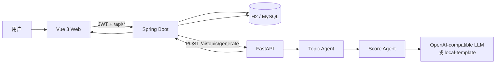
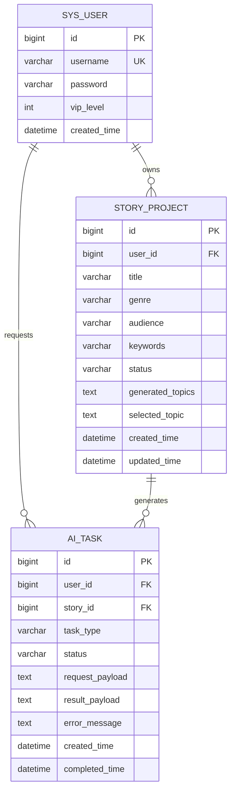

# 架构与数据流

## 设计目标

以最少组件打通一个可验证、可保存、可重复查看的产品闭环。浏览器只访问
Spring Boot；Spring Boot 负责身份、数据归属和持久化；FastAPI 只负责结构化
AI 生成与评分。

## 完整闭环

1. 用户注册或登录，后端签发 JWT。
2. 用户输入标题、题材、受众和关键词，创建 `story_project`。
3. 前端使用故事 ID 请求 `/api/ai/topic/generate`。
4. 后端校验故事属于当前 JWT 用户，并创建 `ai_task`。
5. 后端调用 FastAPI；Topic Agent 生成候选，Score Agent 统一评分和排序。
6. 后端把结构化响应写入 `ai_task`，并把最新结果快照写入故事。
7. 前端展示 10 条方案；用户选择其中一条并保存。
8. 用户返回作品列表后，可以进入详情再次查看相同结果。

## 信任边界

- `userId` 只从已验证的 JWT 中读取，不接受客户端指定。
- 查询、生成和保存操作都校验故事归属，避免水平越权。
- 密码只保存 BCrypt 哈希。
- LLM 密钥只存在于 AI 服务环境变量，不进入浏览器或数据库。
- LLM 输出先经过 JSON 解析和 Pydantic 校验，再返回给后端。
- 后端再次校验恰好 10 条、唯一 ID、必填字段、四维评分和分数范围，避免服务版本漂移把残缺结果标记为成功。
- AI 服务不可用时后端返回明确错误；不会把失败任务标记成成功。

## 数据模型

## 为什么保留本地生成器

本地模板不是 LLM 替代品，而是开发和验收的可重复 fallback：

- 新开发者无需密钥就能验证三服务链路。
- CI 不依赖外部网络和额度。
- 响应通过 `model: "local-template"` 明确披露来源。
- 配置真实密钥后，完全复用同一结构化契约和持久化链路。
