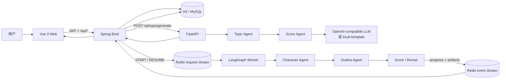
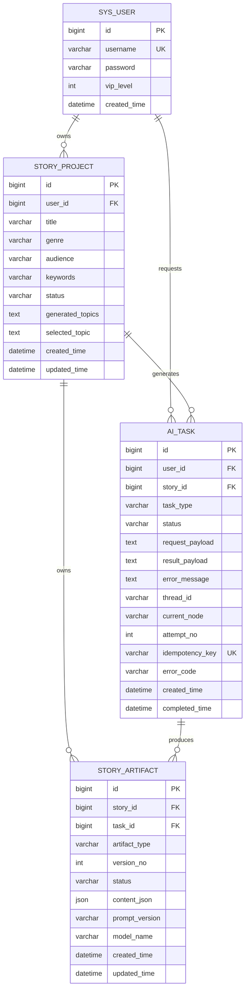

# 架构与数据流

## 设计目标

以最少组件打通一个可验证、可暂停、可恢复、可重复查看的产品闭环。浏览器
只访问 Spring Boot；Spring Boot 负责身份、数据归属和持久化；FastAPI 负责
结构化 AI 生成；Redis Streams 隔离耗时的第二周工作流。

## 完整闭环

1. 用户注册或登录，后端签发 JWT。
2. 用户输入标题、题材、受众和关键词，创建 `story_project`。
3. 前端使用故事 ID 请求 `/api/ai/topic/generate`。
4. 后端校验故事属于当前 JWT 用户，并创建 `ai_task`。
5. 后端调用 FastAPI；Topic Agent 生成候选，Score Agent 统一评分和排序。
6. 后端把结构化响应写入 `ai_task`，并把最新结果快照写入故事。
7. 前端展示 10 条方案；用户选择其中一条并保存。
8. 用户返回作品列表后，可以进入详情再次查看相同结果。

## 第二周异步工作流

1. 用户从已保存的选题启动工作流；后端创建带唯一幂等键的 `ai_task`。
2. 后端向 `story:workflow:requests` 写入 `START`，立即返回 `WAITING`。
3. Python Worker 通过消费者组领取消息并运行 LangGraph。
4. 图依次生成 3～6 个人物、20 节点大纲和五维评分；低于 80 分时最多
   自动修订两轮。
5. Worker 把进度和完整产物事件写入 `story:workflow:events`。后端在同一事务中
   写入任务和版本化产物，成功后才确认事件。
6. 图在 `human_review` 的 `interrupt()` 处暂停。前端轮询到
   `REVIEW_REQUIRED` 后展示三栏审核页。
7. 批准或修改意见会作为 `RESUME` 命令写回请求流，并携带原 `threadId`。
8. 修改会创建新的大纲与评分版本；批准会额外保存 `WORKFLOW_FINAL`，旧版本
   永不覆盖。

本周按计划使用 `InMemorySaver` 作为本地、单 Worker checkpointer，因此从首次
生成到最终批准期间必须保持 Worker 进程运行。生产部署应替换为数据库支持的
持久化 checkpointer，才能跨 Worker 重启恢复审核线程。

Redis Streams 按至少一次投递设计：消费者只在结果发布或持久化成功后 `XACK`，
超时 pending 消息由健康消费者重新领取。数据库唯一键和 Worker 完成标记共同
阻止重复消息生成重复版本。

## 信任边界

- `userId` 只从已验证的 JWT 中读取，不接受客户端指定。
- 查询、生成和保存操作都校验故事归属，避免水平越权。
- 密码只保存 BCrypt 哈希。
- LLM 密钥只存在于 AI 服务环境变量，不进入浏览器或数据库。
- LLM 输出先经过 JSON 解析和 Pydantic 校验，再返回给后端。
- 后端再次校验恰好 10 条、唯一 ID、必填字段、四维评分和分数范围，避免服务版本漂移把残缺结果标记为成功。
- AI 服务不可用时后端返回明确错误；不会把失败任务标记成成功。
- 工作流任务和审核接口再次校验故事所有权，不能通过猜测任务 ID 越权读取。
- 人工审核始终恢复原 `threadId`，不会偷偷创建另一条工作流。
- V1 工作流创建后由后端锁定原选题；并发启动或直接调用选题接口都不能让
  `selected_topic` 与原始任务漂移。
- `total` 分数由应用代码累加五个维度，模型不能自行声明总分。
- 20 节点、连续编号、反转数、早期冲突和结局均由代码机械校验。

## 数据模型

## 为什么保留本地生成器

本地模板不是 LLM 替代品，而是开发和验收的可重复 fallback：

- 新开发者无需密钥就能验证三服务链路。
- CI 不依赖外部网络和额度。
- 响应通过 `model: "local-template"` 明确披露来源。
- 配置真实密钥后，完全复用同一结构化契约和持久化链路。
