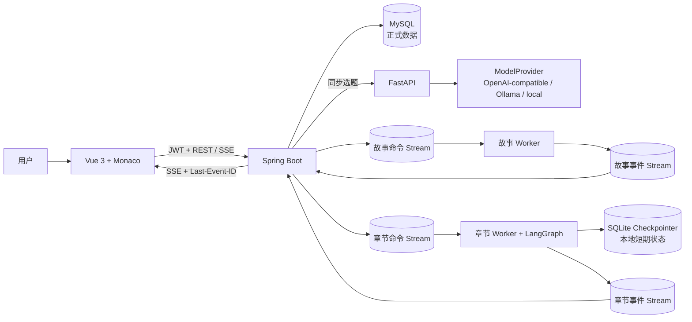
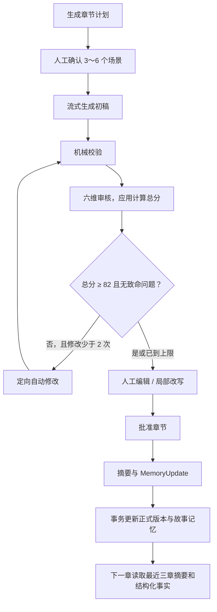
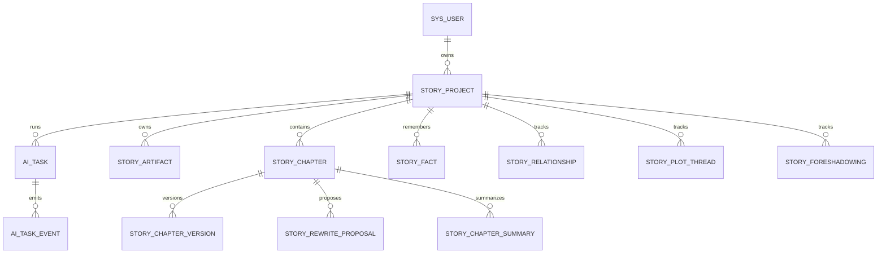

# 架构与数据流

## 设计目标

StoryForge 用最少组件建立三个逐层可验证的闭环：结构化选题、可人工审核的人物与
大纲，以及一次一章的正文创作。浏览器只访问 Spring Boot；Spring Boot 负责身份、
归属校验、正式数据和事件回放；FastAPI/LangGraph 负责 AI 生成；Redis Streams
隔离耗时任务。



## 第一周选题闭环

1. 用户注册或登录，后端签发 JWT。
2. 用户输入标题、题材、受众和关键词，创建 `story_project`。
3. 后端校验故事属于当前用户，创建 `ai_task`，同步调用 Topic Agent 和 Score Agent。
4. AI 服务返回恰好 10 个通过 Pydantic 校验的结构化选题。
5. 后端保存任务快照；用户选择一项后保存，并可从作品列表再次查看。

## 第二周人物与大纲工作流

1. 用户从已保存选题启动工作流；后端使用唯一幂等键创建 `ai_task`。
2. 后端向 `story:workflow:requests` 写入 `START`，立即返回 `WAITING`。
3. 故事 Worker 生成 3～6 个人物、20 节点大纲和五维评分；低于 80 分时最多
   自动修订两轮。
4. Worker 把进度和产物写入 `story:workflow:events`；后端持久化版本后确认事件。
5. 人工批准或修改意见通过原 `threadId` 恢复工作流。每次修改产生新版本，旧版本
   永不覆盖。

第二周保留本地单 Worker 的内存 Checkpointer；其正式人物、大纲和评分版本始终
保存到 MySQL。第三周章节流程已独立升级为持久化 Checkpointer。

## 第三周单章工作流

每一章只能从已批准的大纲开始，并使用独立业务线程：

```text
story:{storyId}:chapter:{chapterNo}:version:{versionNo}
```

实际 `threadId` 为不可预测 UUID，业务标识同时记录在任务状态和数据库中。



### 命令与事件

- Spring Boot 向 `story:chapter:commands` 追加 `PLAN`、`GENERATE`、
  `REWRITE_SELECTION` 或 `FINALIZE` 命令。
- Chapter Worker 使用消费者组运行 LangGraph，将进度和 `TOKEN_DELTA` 追加到
  `story:chapter:events`。
- Spring Boot 先把事件按 `(task_id, event_id)` 幂等写入 `ai_task_event`，再通过
  SSE 推送；浏览器使用事件 ID 重连和去重。
- Worker 在同一个 Redis 事务中分配任务序号并 `XADD`；Producer 不裁剪未消费
  事件，Spring 仅在事务持久化并确认后裁剪 Stream。后端接受严格递增但允许缺口
  的序号，Redis Stream ID 才是传输游标。
- 确定性的跨服务契约错误会持久化为 `TASK_FAILED`、写入 dead-letter Stream 并
  `XACK`，数据库故障等可恢复错误才保留在 Pending 中重试。
- 正文 Token 可在确认后从 Redis 中裁剪，但最终正文、审核、提案和摘要只以
  MySQL 为准。
- Pending 命令和事件由健康消费者重新领取；重复投递由命令幂等键、事件唯一键和
  版本幂等键共同消除副作用。Worker 锁使用随机 Owner Token、心跳续租和
  Compare-and-delete，过期 Worker 不能删除新 Worker 的锁。

### 两类记忆

| 记忆 | 示例 | 存储 |
|---|---|---|
| 当前章短期状态 | 草稿、当前评分、修改次数、节点 | LangGraph SQLite Checkpointer（本地） |
| 跨章节长期事实 | Canon Facts、关系、剧情线、伏笔、摘要 | MySQL 业务表 |

故事与章节 Worker 的 Checkpointer 都挂载到命名卷，因此本地 Worker 重启后仍可恢复；
故事 HTTP 服务与故事 Worker 共享 `/data/story/story-checkpoints.sqlite`，不会因容器
重启或进程切换丢失线程。生产环境应切换到数据库型 Checkpointer；正式业务数据不依赖
该 SQLite 文件。AI HTTP 路由使用 `X-Internal-API-Key` 做服务间认证，Compose 不把
AI 服务端口发布到宿主机。

### 编辑与版本

`story_chapter` 只引用当前版本；`story_chapter_version` 保存不可变正文历史。正文、
来源、哈希和版本关系不会原地覆盖；生成后的审核元数据只允许在内容哈希仍匹配且
尚未写入时附加一次。正文初稿、自动修订、人工编辑、接受局部改写、恢复和批准都
创建新版本。保存使用 `baseVersionId`/内容哈希做乐观并发，迟到的 AI 结果不能覆盖
用户的新版本。

局部改写先创建 `story_rewrite_proposal`：AI 只返回建议文本，不直接写正文。接受前
再次校验基础版本、偏移和选区 SHA-256；拒绝只更新提案状态。恢复历史版本本身也
产生 `RESTORE` 版本，审计链不会消失。

章节批准后，后端在事务中保存批准版本、摘要和经过校验的 MemoryUpdate。带
`locked=true` 的 Canon Fact 不允许被 Agent 覆盖，只记录连续性警告。

## 信任边界

- `userId` 只从已验证 JWT 读取，不接受客户端指定；故事、任务、章节、版本和提案
  每次访问都校验归属。
- 密码只保存 BCrypt 哈希；LLM 密钥只存在服务端环境变量，不进入 Vue 或数据库。
- 所有结构化 LLM 输出先经 Pydantic 校验；计划还检查 3～6 个连续场景和已登记角色。
- 五维故事评分和六维章节评分都由应用代码求和，模型不能自行声明总分。
- 正文的长度、空内容、段落和重复等确定性问题使用代码检查。
- 自动修订最多两次；用户人工确认是计划、正文和长期记忆的硬边界。
- SSE 使用 Authorization Header，不把 JWT 放进 URL；`Last-Event-ID` 只允许读取
  当前用户任务的持久化事件。

## 核心数据模型



## 本地模型的角色

`local-template` 不是生产 LLM 的伪装，而是确定性开发适配器：

- 无密钥也能验证三服务、Redis、SSE、版本和记忆全链路。
- CI 不依赖外部网络和额度。
- 响应和版本元数据明确记录实际模型来源。
- 切换 OpenAI-compatible 或 Ollama 时复用相同 Schema、工作流和持久化契约。
